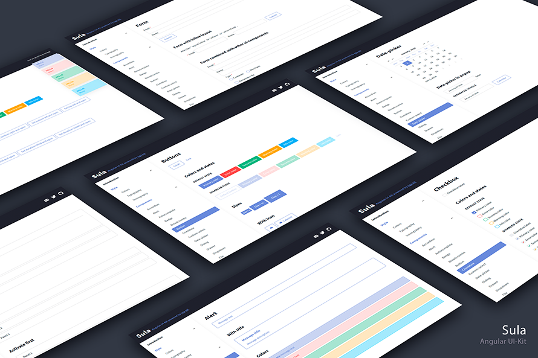

# Sula

Starter-pack with simple style-guide, icons and a library of [Angular](https://angular.io) components based on [ngx-kit](https://ngx-kit.com).

## Demo

[Sula ui-docs live](https://sula.ngx-kit.com).

## Installation

Clone the repo:

`git clone https://github.com/ngx-kit/sula.git`

Install npm modules:

`cd sula && npm i`

## Structure

* `projects/ui` - set of ui-components.
* `projects/ui-docs` - representation of style-guide and ui-components.
* `projects/main` - main application starter.

## Usage

* Run `ng run ui-docs:serve` and open `http://localhost:4100/` to explore UI Kit.

* Run `ng serve` for a dev server for the main app. Navigate to `http://localhost:4200/`. The app will automatically reload if you change any of the source files.  

* Check demos in `ui` to find how to use the components. 
